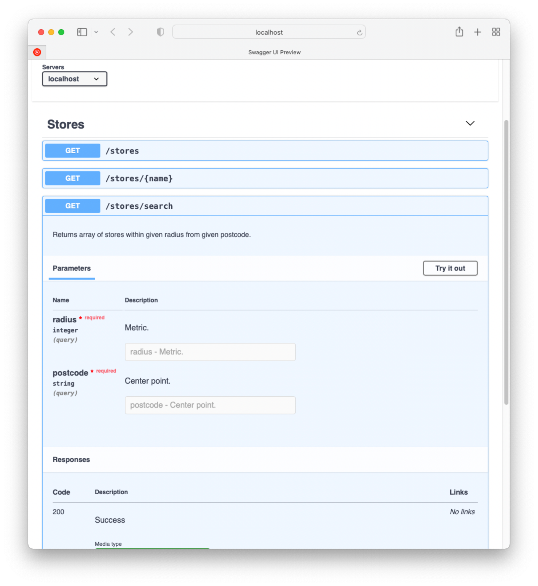

# Tasks

- [x] Can get the list of stores in stores.json
- [x] Can get the specific item of stores in stores.json by name
- [x] Can get the coordinates of postcode of stores
- [x] Can search stores within given radius from given point in postcode

# Start
```
npm install
npm start
```

# APIs

- /stores
  - returns array of all stores in stores.json
- /stores?coords=ture
  - returns array of all stores in store.json with coords property in each store item. Coords property includes latitude and longitude.
- /stores/search?postcode=BN14%209GB&radius=5000
  - returns array of all stores within given radius from given postcode
  
- Sample image from API.yaml


# Final questions

1. If given more time, I would first implement test codes for APIs. Without test codes, it is difficult to modify or refactor the code. Another thing in mind is to handle errors in more graceful way. Not sure if it's intended, but a store item { "name": "Bagshot", "postcode": "GU19 5DG" } was invalid. At first, I had to spend much of time finding error in my code, but later found out that the a postcode of an item could be invalid.

2. As mentioned above, encountering unexpected error from task's source file was the most time-consuming obstacle to solve. With limited time, it was impossible for me to create an algorithm to calculate distance between two coordinates. Thus, geolib module had to be imported. Also, third question was quite ambiguous. At first glance, the word postcode from the phase "providing coordinates of each postcode"  could be inferred in few different ways. Like providing an independent API for converting postcode to coordinates, or including coordinates property when sending each postcode of stores.

3. By mentioning stores.json may contain an item with an invalid postcode would help.
